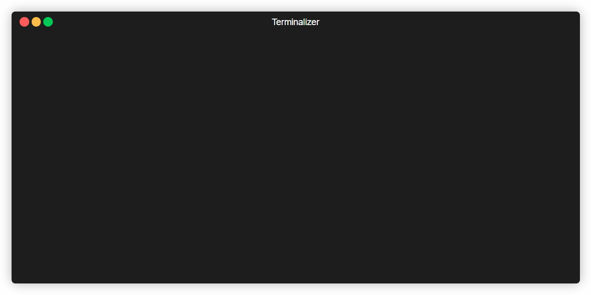

# Security Sensei

**Find vulnerabilities. Learn why they matter.**

A security scanner that doesn't just flag problems—it teaches you how to fix them and why they're dangerous.

[](https://www.python.org/downloads/)
[](https://opensource.org/licenses/MIT)
[]()

```bash
pip install security-sensei
sensei scan ./my-project
```

---

## Demo



---

## What Makes This Different

Most security scanners give you a list of problems. Security Sensei gives you an education.

For every finding, Sensei provides:

- **What it is** — Clear explanation of the vulnerability type
- **Why it's dangerous** — Real attack scenarios showing how it could be exploited
- **How to fix it** — Concrete code examples, not just generic advice
- **CWE & OWASP mapping** — Links to industry standards for deeper learning

This isn't just a tool—it's a learning experience that makes you a better developer.

---

## Features

| Scanner | What It Catches | Languages |
|---------|-----------------|-----------|
| **Secrets** | API keys, tokens, passwords, private keys, secrets in git history | All |
| **Code** | SQL injection, XSS, command injection, path traversal, insecure deserialization | Python, JavaScript |
| **Config** | Debug mode enabled, permissive CORS, default credentials, insecure settings | All |
| **Dependencies** | Known CVEs, outdated packages, vulnerable dependencies | Python, Node.js |
| **Web** | localStorage tokens, missing security headers, eval() usage | JavaScript/TypeScript |
| **Deployment** | Dockerfile issues, CI/CD misconfigs, missing .gitignore entries | All |

---

## Installation

**From PyPI:**
```bash
pip install security-sensei
```

**For development:**
```bash
git clone https://github.com/danieljcheung/security-sensei.git
cd security-sensei
pip install -e ".[dev]"
```

---

## Usage

### Basic Scan
```bash
sensei scan .                        # Scan current directory
sensei scan ./src --severity high    # Only show high+ severity
sensei scan . --category secrets     # Run specific scanner
sensei scan . --verbose              # Show code snippets
```

### Output Formats
```bash
sensei scan . --output json          # JSON output for CI/CD
sensei scan . --output markdown      # Markdown report
sensei scan . --quiet                # Minimal output for scripts
```

### Git History Scanning
Scan for secrets that were committed and later removed:
```bash
sensei scan . --include-git-history
```

### Auto-Fix
Let Sensei fix simple issues automatically:
```bash
sensei scan . --fix                  # Apply safe auto-fixes
sensei scan . --fix --dry-run        # Preview fixes without applying
```

### Baseline Management
Mark known issues as accepted so they don't fail your build:
```bash
sensei baseline --add ID "reason"    # Accept a finding
sensei baseline --list               # View baseline
sensei baseline --remove ID          # Remove from baseline
sensei baseline --clear              # Clear all
```

### Demo Mode
Run a showcase demo for recordings or screenshots:
```bash
sensei demo                          # Run demo
sensei demo --slow                   # Slower for GIF recording
```

---

## Claude Integration

Security Sensei's JSON output is designed to feed directly into Claude for deeper analysis.

```bash
# Generate findings
sensei scan . --output json > findings.json

# Ask Claude to explain
claude "Explain the SQL injection finding in findings.json and show me 3 ways an attacker could exploit it"
```

Claude can provide:
- **Personalized explanations** based on your codebase context
- **Attack scenarios** specific to your application
- **Follow-up Q&A** to deepen your understanding
- **Custom fix suggestions** that match your coding style

---

## CI/CD Integration

### GitHub Actions

```yaml
name: Security Scan

on: [push, pull_request]

jobs:
  security:
    runs-on: ubuntu-latest
    steps:
      - uses: actions/checkout@v4
        with:
          fetch-depth: 0  # Full history for git scanning

      - name: Set up Python
        uses: actions/setup-python@v5
        with:
          python-version: '3.11'

      - name: Install Security Sensei
        run: pip install security-sensei

      - name: Run Security Scan
        run: sensei scan . --output json > results.json

      - name: Upload artifact
        uses: actions/upload-artifact@v4
        with:
          name: security-scan-results
          path: results.json
```

### Exit Codes

| Code | Meaning |
|------|---------|
| `0` | No critical or high severity findings |
| `1` | High severity findings found |
| `2` | Critical severity findings found |

---

## Why I Built This

I learn security by building. After vibe-coding several projects, I realized they all needed a security review before going to production—but most scanners just give you a wall of findings with no context.

I wanted a tool that:
- **Teaches while it scans** — Every finding is a learning opportunity
- **Explains the "why"** — Real attack scenarios, not just CVE numbers
- **Fits my workflow** — CLI-first, CI/CD ready, Claude-compatible

Security Sensei is the tool I wished I had when I started learning application security.

---

## Roadmap

- [x] Auto-fix capabilities
- [x] Baseline management for accepted risks
- [x] Git history scanning
- [x] JSON and Markdown output formats
- [ ] SARIF output for GitHub Security tab
- [ ] More language support (Go, Rust, Java)
- [ ] VS Code extension
- [ ] Container image scanning
- [ ] Infrastructure as Code scanning (Terraform, CloudFormation)

---

## Contributing

Contributions are welcome! Whether it's:
- Adding new vulnerability patterns
- Supporting new languages/frameworks
- Improving documentation
- Fixing bugs

Check out the [open issues](https://github.com/danieljcheung/security-sensei/issues) or open a new one.

---

## License

MIT License - see [LICENSE](LICENSE) for details.

---

<p align="center">
  <strong>Security Sensei</strong> — Because understanding vulnerabilities makes you dangerous (to attackers).
</p>
